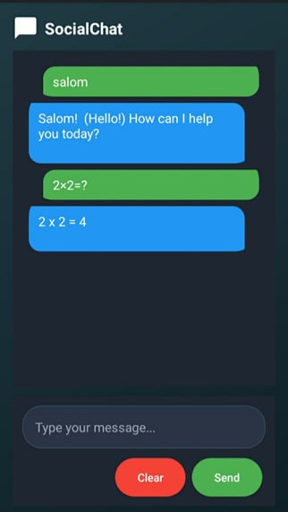

# 💬 Java Android Messenger

**Java Android Messenger** is a smart, AI-powered chat application built using **Java** and **SQLite (Room DB)** for Android. It uses the **Gemini API** to provide real-time responses to every user prompt, simulating a real conversation between user and bot.

## 📸 Preview
### 🖥️ Desktop


### 📱 Mobile
<div style="display: flex; justify-content: space-between; gap: 10px;">
  
  
  
</div>

---

## 🚀 Features

🤖 **Gemini AI Responses** – Get real-time answers using Google’s Gemini API
💬 **Interactive Chat** – Smooth message exchange between user and bot
📱 **Modern UI** – Beautiful and responsive chat interface
📦 **Room Database** – Stores all messages locally using SQLite Room DB
✨ **Dynamic Styling** – User and bot messages shown in different styles
🧠 **Typing Animations** – Realistic bot typing effect

---

## 🎯 How to Run

1. Clone the repository

   ```bash
   git clone https://github.com/Iqbolshoh/java-android-messenger.git
   cd java-android-messenger
   ```
2. Open in **Android Studio**
3. Sync Gradle and build the project
4. Run on an emulator or a physical device

> ⚠ Make sure to add your own **Gemini API Key** in the `ApiService.java` file.

---

## 🛠 Technologies Used

<div style="display: flex; flex-wrap: wrap; gap: 5px;">
  
  
  
  
  
</div>

## 📜 License
This project is open-source and available under the **MIT License**.

## 🤝 Contributing  
🎯 Contributions are welcome! If you have suggestions or want to enhance the project, feel free to fork the repository and submit a pull request.

## 📬 Connect with Me  
💬 I love meeting new people and discussing tech, business, and creative ideas. Let’s connect! You can reach me on these platforms:

<div align="center">
  <table>
    <tr>
      <td>
        <a href="https://iqbolshoh.uz" target="_blank">
          
        </a>
      </td>
      <td>
        <a href="mailto:iilhomjonov777@gmail.com" target="_blank">
          
        </a>
      </td>
      <td>
        <a href="https://github.com/iqbolshoh" target="_blank">
          
        </a>
      </td>
      <td>
        <a href="https://www.linkedin.com/in/iqbolshoh/" target="_blank">
          
        </a>
      </td>
      <td>
        <a href="https://t.me/iqbolshoh_777" target="_blank">
          
        </a>
      </td>
      <td>
        <a href="https://wa.me/998997799333" target="_blank">
          
        </a>
      </td>
      <td>
        <a href="https://instagram.com/iqbolshoh_777" target="_blank">
          
        </a>
      </td>
      <td>
        <a href="https://x.com/iqbolshoh_777" target="_blank">
          
        </a>
      </td>
      <td>
        <a href="https://www.youtube.com/@Iqbolshoh_777" target="_blank">
          
        </a>
      </td>
    </tr>
  </table>
</div>
